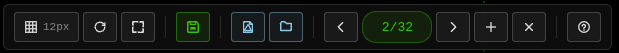

<!-- Lock-up : logo + wordmark « meshes designer » centrés.
     align="center" survivaliste sur GitHub (et la plupart des
     renderers markdown) — <div align> n'est pas autorisé en
     HTML5 strict mais GitHub l'interprete quand meme en mode
     legacy. width=120 sur l'image : equilibre entre presence
     visuelle en haut de page et encombrement minimise (le logo
     est vectoriel, donc aucun blur a cette taille). L'attribut
     alt porte le nom complet pour les lecteurs d'ecran /
     navigateurs en mode image-desactivee. Le H1 markdown
     classique suit pour beneficiare de l'auto-slug (ancre
     explicite) que GitHub genere sur les titres H1 — utile si
     y fait reference ailleurs vers `#meshes-designer`. Le nom
     passe de kebab-case (meshes-designer, nom du repo) a
     wordmark avec espace (meshes designer) ; les deux formes
     coexistent : le HTML <title> deja pose utilise la forme
     wordmark (cf. main.html). -->

<p align="center">
  
</p>

# meshes designer

Éditeur de maillages 2D en **vanilla JavaScript** (aucune dépendance, aucun build). Dessiner des points, constituer des triangles, sauvegarder / charger des scènes au format JSON ou « meshes », pivoter / zoomer / déplacer la vue à la souris.

## Démarrage rapide

Le projet est 100 % statique, mais le module `convert.js` lit des fichiers locaux via `FileReader`, ce qui impose d'ouvrir la page via HTTP (et non en `file://`).

```bash
# Depuis la racine du projet :
python3 test_server.py
# puis ouvrir http://localhost:8000/main.html dans un navigateur
```

Le script `test_server.py` lance un serveur HTTP trivial sur le port 8000 (en thread daemon). Il vérifie que le port a bien été bindé et qu'il répond avant d'imprimer `Server is running`, et sort en erreur avec un message explicite si le port est déjà occupé.

## Version portable (zéro serveur, zéro toolchain)

En complément du mode serveur, un script de build — **Option A** de `PORTABILITE.md` — fabrique une **version portable** : un fichier `meshes-portable.html` unique et autonome, ouvrable en double-clic même en `file://`, sans serveur ni dépendance (transportable sur clé USB).

### Générer

```bash
npm run build:portable          # équivalent à : node scripts/build-portable.mjs
```

Le fichier `meshes-portable.html` est écrit à la racine du projet. C'est un **artefact de build gitignoré, toujours régénérable** : les sources multi-fichiers restent canoniques, le script ne les modifie jamais.

Pour **valider** la version portable (re-build + vérifications statiques + test navigateur en `file://`, sans serveur) :

```bash
npm run check:portable          # équivalent à : node scripts/check-portable.mjs
```

Le check relance d'abord le build (l'artefact validé est toujours frais), puis : `node --check` sur le script fusionné, zéro import/export résiduel, zéro ligne vide, shim `localStorage` et renommages présents, regex des sources présents byte-à-byte ; enfin un parcours navigateur en `file://` (chargement, création de point + persistance, zoom molette, rechargement, autoimport — qui exerce en direct les regex de `convert.js`). Même harnais que les smoke tests (`scripts/smoke_lib.mjs`, Chromium système via `CHROMIUM_PATH`).

Pour valider **l'artefact tel que publié par la CI** (le zip `meshes-portable` téléchargé depuis GitHub Actions — pas le fichier rebuildé en local) :

```bash
npm run check:artifact          # équivalent à : node scripts/check-artifact.mjs
npm run check:artifact -- --local meshes-portable.html   # ou un fichier local
```

Le mode par défaut télécharge le dernier artefact du dernier run `master` réussi via `gh` CLI (**prérequis : `gh` authentifié + `unzip`**) et lance le même parcours navigateur `file://` — il prouve que le fichier livré par la CI fonctionne vraiment en double-clic. `--out-dir <dir>` contrôle le dossier d'extraction (défaut : temp, nettoyé), `--keep` le conserve, `--local <fichier>` teste un fichier local sans prérequis CI (le fichier doit déjà exister — `npm run build:portable` d'abord si besoin). Ce test post-CI n'est pas dans `npm run check:portable` ni dans le workflow : il dépend d'un run `master` publié, il reste donc volontairement un outil de vérification manuelle.

### Ce que fait le script

1. **Fusion** : extrait les `<script type="module" src="…">` de `main.html` dans l'ordre topologique des tags, concatène les modules en un unique `<script type="module">` **inline** (un module inline n'est pas soumis au CORS `file://` — rien n'est fetché, c'est le blocage décrit en §1.1 de `PORTABILITE.md`), et supprime les imports/exports (renommages `import { state as _stateForShape }` et ré-exports `export { … }` gérés).
2. **Shim `localStorage`** : Firefox lève `SecurityError` à l'accès sur `file://` ; un shim en tête du script bascule vers un stockage mémoire si l'accès lève (Chrome/Edge/Safari inchangés).
3. **Allègement** : tous les commentaires (JS, CSS, HTML) sont retirés et les lignes vides comprimées — sans jamais toucher aux chaînes, template literals ni regex literals (heuristique regex-vs-division calibrée sur les sources). Le portable pèse ~210 Ko au lieu de ~347 Ko brut.
4. **Assets** : le dossier `assets/` est copié à côté du fichier quand la sortie diffère de la racine (ex. `--out dist/`).
5. **Auto-validation** : `node --check` sur chaque module strippé puis sur le script fusionné, détection des collisions de bindings top-level, et garde « aucun import/export résiduel » — le build échoue fort (fichier + ligne) plutôt que de livrer un portable cassé.

### Options

| Option | Effet |
|---|---|
| `--out <chemin>` | Fichier de sortie (défaut : `meshes-portable.html` à la racine). Avec un slash final (`--out dist/`), écrit `<dossier>/meshes-portable.html`. |
| `--no-assets` | Ne copie pas le dossier `assets/`. |
| `--keep-markers` | Conserve les marqueurs de débogage (banner + noms de modules + en-tête du shim). Par défaut, tous les commentaires sont retirés. |
| `-h, --help` | Affiche l'aide du script. |

### Utiliser / distribuer

1. **Lancer** : double-clic sur `meshes-portable.html` → l'app démarre hors-ligne, sans serveur. Toutes les fonctions marchent : édition, zoom/pan, grille, persistance `localStorage`, import/export (le `FileReader` et les downloads fonctionnent sous `file://`, cf. `PORTABILITE.md` §1.3-1.4).
2. **Garder le dossier `assets/` à côté du fichier** : le portable référence `assets/favicon.svg` (le favicon du `<link rel="icon">` — le seul asset utilisé par l'app) ; le reste du dossier (logo.svg, barre_boutons.png, meshes d'exemple) ne sert qu'au README du repo et aux imports. Le build copie `assets/` automatiquement quand la sortie est dans un autre dossier (`--out dist/`) ; à la racine du projet il est déjà présent. `--no-assets` ne doit être utilisé que si les assets sont inutiles pour l'usage visé.
3. **Régénérer** après chaque modification des sources : `npm run build:portable` — l'artefact est gitignoré et toujours reconstruisible, les sources multi-fichiers restent la référence.

## Workflow type (exemple : un triangle)

1. Lancer le serveur (`python3 test_server.py`) et ouvrir `http://localhost:8000/main.html`.
2. Appuyer sur `G` → la grille s'affiche ; le bouton « Grille » passe en vert et affiche le pas courant.
3. Cliquer trois fois sur le canvas → les clics remplissent successivement les slots `p1`, puis `p2`, puis `p3` du **dernier triangle partiel**. Le premier clic insère donc un triangle `{p1}`, le deuxième lui ajoute `p2`, et le troisième complète `{p1, p2, p3}` (premier triangle complet). Au-delà du troisième clic, un nouveau clic suffisamment proche d'une ligne existante crée un triangle attaché à cette ligne (`{p1, p2, p3}` directement complet, dont deux sommets sont les extrémités de la ligne).
4. Le mode unique est **édition** : un clic gauche crée un point dans le vide ou sélectionne + le plus proche selon `state.selectionMode`, un clic gauche-glissé délimite un lasso, et un clic droit + drag déplace la sélection (même si le pointeur démarre loin de la géométrie).
5. Choisir la cible sommet / segment / triangle avec le bouton dédié, puis sélectionner plusieurs points (clic ou rectangle de sélection) et éventuellement les faire pivoter à la molette. Clic gauche plein **remplace** la sélection, **Ctrl/Cmd + clic droit** **ajoute** sans doublon, **Maj + clic** **toggle**.
6. **Sauvegarder** avec `Ctrl+S` (ou le bouton vert *save*) → la scène descend en JSON.
7. **Recharger** plus tard via le bouton bleu *Charger meshes* (1 ligne = 1 forme) ou *Charger JSON* (round-trip exact pour les triangles complets ; les triangles partiels sont filtrés), au choix *Remplacer* ou *Fusionner*.
8. Naviguer entre formes via ◀ / ▶, créer une forme vide avec +, supprimer la forme active avec ×.
9. En cas d'erreur : `Ctrl+Z` annule, `Ctrl+⇧+Z` / `Ctrl+Y` rétablissent.

Orienter la vue pendant la construction : **molette** pour zoomer (×1.1 par cran, centré sur le curseur), **clic milieu + drag** pour déplacer le repère (pan), `Ctrl+0` pour revenir à 100 % centré sur l'origine.

## Fonctionnalités

- **Scène multi-formes** : chaque forme possède ses propres points (`pointList`) et triangles (`tris`). Navigation par *forme précédente / suivante / nouvelle / supprimer* depuis la barre d'outils, ou via le compteur `i/N` affiché en pilule verte.
- **Forme active seulement** : les opérations d'édition (sélection, déplacement, suppression) ne concernent que la forme courante ; les autres sont rendues en lignes estompées pour contexte.
- **Grille magnétique** : pas affichable et ajustable à la molette sur le bouton grille ; middle-click sur ce même bouton réinitialise le pas au défaut ; `G` affiche / masque.
- **Cercle** : création d'un disque par génération d'un éventail de triangles (choisi dans le panneau Formes ou raccourci `C` ; tracé en 2 clics : le 1er pose le centre, le mouvement de la souris règle simultanément le rayon ET l'angle de départ (le sommet 0 du polygone pointe vers la souris), le 2e clic valide ; molette sur le canvas ou sur le bouton actif = nombre de côtés, mémorisé entre les sessions ; le mode se désactive après chaque création, `Échap` quitte, clic droit annule le tracé).
- **Navigation** :
  - **wheel** : zoom centré sur le curseur (×1.1 par cran, clamp `[0.1, 10]`) ; pivote les points sélectionnés si 2+ sont sélectionnés.
  - **middle-click + drag** : déplace l'origine (pan du `viewCenter`), le contenu suit le curseur (convention « grab content »).
  - **Ctrl+0** : réinitialise le zoom à 100 % et `viewCenter` à l'origine.
- **HUD bas-gauche** : indicateur de zoom (`1.2x pos(45, -30)`, plus `rot X°` cumulatif après une AltGr + molette autour du curseur) et coordonnées du curseur en temps réel.
- **Persistance** : la scène et le zoom/pan sont sauvegardés dans `localStorage` et restaurés au rechargement. Le zoom, le pan et l'état de grille sont des préférences de vue : ils sont persistés sans faire passer le statut de scène à « modifiée » ; les mutations de géométrie, formes et couleurs le font. L'historique undo/redo est lui aussi persisté (clé dédiée `meshesDesigner.undo`, vérifiée contre un fingerprint de la scène au rechargement) ; il est réinitialisé — en mémoire et sur disque — au reset complet de la scène et à l'import en mode *Remplacer* (l'import *Fusionner* le conserve).
- **Annuler / Rétablir** : `Ctrl+Z` / `Ctrl+⇧+Z` / `Ctrl+Y`.
- **Mode d'édition unique** : mode **édition** combine création, sélection et déplacement ; le clic gauche crée un point dans le vide ou sélectionne l'entité sous le pointeur selon `state.selectionMode`, le clic gauche-glissé trace uniquement le lasso, le clic droit simple sélectionne uniquement l'entité la plus proche et désélectionne les autres, le clic droit + drag déplace la sélection, et **Ctrl/Cmd + clic droit** ajoute une entité à la sélection sans la déplacer. Le mode de cible reste sommet / segment / triangle.
- **Import / Export** : JSON de scène (round-trip exact pour les triangles complets, enveloppe `format: "meshes-designer"`, `version: 1`) ou format texte « meshes » (1 ligne = 1 forme). Les triangles partiels du texte sont parsés puis filtrés avant hydratation. Les erreurs de structure et d'indices sont signalées avant modification de la scène.
- **Précision stable** : les rayons de détection sont exprimés en pixels écran puis convertis selon le zoom ; la sélection garde donc une sensation constante à 0.1x comme à 10x.
- **État de sauvegarde** : le HUD indique si la scène est modifiée ou sauvegardée.

## Raccourcis clavier

| Touche | Action |
|---|---|
| `Backspace` | Supprimer le point sélectionné |
| `⇧+Backspace` | Réinitialiser complètement la scène (modale de confirmation) |
| `Ctrl+Z` | Annuler |
| `Ctrl+⇧+Z` ou `Ctrl+Y` | Rétablir |
| `Ctrl+S` | Sauvegarder la scène en JSON |
| `Ctrl+0` | Réinitialiser le zoom (100 %, recentré sur l'origine) |
| `G` | Afficher / masquer la grille |
| `P` | Prévisualiser la scène (masque points de contrôle, axes, grille, HUD et boutons ; `Échap`, `P` ou clic gauche pour quitter — molette = zoom, clic milieu = pan, aucune édition) |
| `C` | Activer / désactiver le mode cercle (tracé en 2 clics : 1er = centre, mouvement = rayon + angle de départ, 2e = valider ; molette = nombre de côtés, mémorisé entre les sessions) |
| `E` | (Supprimé — un seul mode édition) |
| `?` | Afficher / masquer l'aide |
| **Souris** | |
| wheel sur canvas | Zoom (centré sur curseur) ou pivote si 2+ points sélectionnés |
| **altgr + wheel** sur canvas | **Rotation de chaque forme autour du curseur** (5°/cran, cumulatif, réinitialisable par Ctrl+0). Le pivot est la position de la souris dans la scène (coords modèle sous le curseur, suivi à chaque tick si elle bouge). |
| middle-click + drag canvas | Pan (déplace `viewCenter` dans le sens du drag) |
| **Ctrl+Alt + clic-droit + drag** canvas (AltGr = Right Alt sur la plupart des claviers) | **Déplacer TOUTES les formes ensemble** (delta uniforme, quasi-mode : relâcher ne change rien en cours de drag) |
| middle-click sur bouton grille | Réinitialise le pas de la grille |

## Interface — barre d'outils

Carte flottante en haut à gauche, séparée en groupes cohérents par des traits verticaux :



Légende (de gauche à droite) :

- **Canevas / édition** — `▦` *Grille* : afficher / masquer la grille (raccourci `G`). Affiche le pas à droite de l’icône ; molette sur ce bouton = ajuster le pas, *clic milieu* sur le bouton = réinitialiser le pas. `Réticule` cycle trois états (`R`). `👁` *Prévisualiser* : masque les points de contrôle, axes, grille, HUD et boutons pour ne laisser que la géométrie (raccourci `P`, sortie `Échap` ou clic gauche ; molette = zoom, clic milieu = pan, aucune édition). Le bouton cible cycle *sommet / segment / triangle*. `⋆` *Formes* : ouvre la liste des formes prédéfinies (cercle, rectangle, carré, triangle, pentagone, hexagone, étoile) ; choisir une forme puis la tracer en **2 clics** sur le modèle du cercle (1er clic = ancre — coin pour rectangle/carré, centre pour les polygones —, mouvement = taille et orientation — le sommet 0 pointe vers la souris pour les polygones —, 2e clic = valider). Le *cercle* s'y choisit aussi, et reste accessible via `C` (tracé en 2 clics, molette sur le canvas ou sur le bouton actif = nombre de côtés, mémorisé). L'*étoile* fait exception : elle se trace en **3 clics** (1er = centre, mouvement = rayon + angle de départ — le 1er pic suit la souris, 2e = verrouille, mouvement = profondeur des branches, 3e = valider) ; `Échap` quitte le mode, clic droit ou `Backspace` annulent le tracé. `↻` *Reset* : réinitialiser complètement la scène (`⇧+Backspace`, modale de confirmation). `▢` *Tout sélectionner* : sélectionne tous les points de la forme active.
- **Annuler / Rétablir** (2 boutons gris + compteur) — `↶` *Annuler* (`Ctrl+Z`) : dépile une entrée de `historyStack` (jusqu'à `MAX_HISTORY = 50`, les plus anciennes étant évincées à mesure). `↷` *Rétablir* (`Ctrl+Shift+Z` ou `Ctrl+Y`) : dépile `redoStack`. Le compteur central est une pilule verte read-only `(N)` qui affiche la profondeur de `historyStack`. Les boutons sont automatiquement grisés (attribut HTML `disabled` + opacité 0.35 + curseur `not-allowed`) quand leur pile respective est vide, pour que l'état disponible soit visible d'un coup d'œil ; clic impossible dans cet état. Le compteur et l'état disabled sont synchronisés par `updateUndoRedoHud()`, appelée à chaque mutation des piles (saveState / undo / redo / import / reset complet / boot). L'historique est persisté dans `localStorage` (clé `meshesDesigner.undo`) et restauré au retour dans l'application (rechargement) tant que la scène restaurée correspond ; il est réinitialisé au reset complet de la scène et à l'import en mode *Remplacer* — l'import *Fusionner* le conserve.
- **Sortie** (1 bouton vert, accent vert + silhouette disquette) — `▤ SAVE` : exporte la scène courante en JSON (`Ctrl+S`). La couleur et la silhouette (disquette) sont distinctes des entrées pour éviter l'ambiguïté (les anciennes flèches haut/bas étaient des miroirs faciles à inverser).
- **Entrées** (2 boutons bleus) — `▤△ MESHES` : importe un fichier texte « meshes » (1 ligne = 1 forme). `▤ JSON` : importe une scène JSON (round-trip exact) ; un drop direct d'un fichier `.json` sur le canvas déclenche aussi l'import.
- **Navigation entre formes** (4 boutons gris + compteur) — `◀` *forme précédente*, `▶` *forme suivante*, `(i/N)` *compteur actif / total* en pilule verte (read-only), `+` *ajouter une forme vide*, `×` *supprimer la forme active*.
- **Console** (1 bouton gris, accent vert quand active) — *Console* : afficher / masquer la console des messages. La console est un overlay encadrée (`#messageBoard`, fond noir transparent + bordure verte 1 px) avec un **bandeau de titre** (drag handle pour déplacer) et une **poignée SE** (resize handle). La zone de logs (`#messageLog`) est scrollable si trop de logs pour la hauteur du cadre. Chaque entrée de log est préfixée par un timestamp `[HH:MM:SS]`. Un bouton corbeille dans le bandeau efface le contenu. La visibilité, la position et la taille du cadre sont mémorisées dans `localStorage` et restaurées au rechargement (clés séparées : `meshesDesigner.consoleVisible`, `meshesDesigner.consoleFrame`).
- **Aide** (1 bouton gris) — `?` ouvre le modal des raccourcis (touche `?` au clavier également).

Les icônes de cette barre sont des **SVG inline** `stroke="currentColor"` 14 × 14 px dans le DOM (pas des images) ; la capture ci-dessus (`assets/barre_boutons.png`) les montre tels qu'ils apparaissent à l'écran. Les libellés textuels sont volontairement cachés pour gagner de la place (l'icône seule suffit car chaque bouton est détaillé dans la légende ci-dessous) : le verbe reste accessible dans le `title=` (tooltip au survol) et dans la modale d'action.

## Format de fichier

### Format « meshes » (texte, 1 ligne = 1 forme)

```
x1,y1;x2,y2;x3,y3;x4,y4;...
```

Chaque triplet consécutif de coordonnées forme un triangle. Un reliquat de 1 ou 2 points en queue de ligne est parsé comme triangle partiel pour préserver le format texte ; lors de l'import, la frontière JSON/IO filtre ces triangles incomplets et ils ne sont donc pas hydratés dans la scène. Toutes les coordonnées sont des flottants, séparées par `,`, les sommets par `;`. Les coordonnées identiques (même `x,y`) sont dédupliquées dans `pointList`.

`assets/alphabet2` est un exemple historique au format meshes.

### Format JSON (round-trip de la scène interne)

```json
{
  "shapes": [
    {
      "pointList": [
        { "x": 0, "y": 0 },
        { "x": 10, "y": 0 },
        { "x": 5, "y": 8.66 }
      ],
      "tris": [
        { "p1": 0, "p2": 1, "p3": 2 }
      ]
    }
  ],
  "activeShapeIndex": 0,
  "GRID_STEP": 5,      "activeGrid": true,
  "zoomLevel": 1,
  "viewCenter": { "x": 0, "y": 0 }
}
```

Les index `p1, p2, p3` sont des positions dans `pointList`.

## Mode d'import

Cliquer sur le bouton bleu **« Charger meshes »** (icône page + triangle) ou **« Charger JSON »** (icône dossier) ouvre un picker. Une modale propose ensuite deux modes :

- **Remplacer** la scène courante (défaut).
- **Fusionner** : ajoute les formes importées aux formes existantes (utile pour assembler des pièces).

Un drop direct d'un fichier JSON sur le canvas déclenche aussi l'import.

## Organisation du code

| Fichier | Rôle |
|---|---|
| `main.html` | Layout, CSS (toolbar, HUD, modales), déclaration des boutons et du modal d'aide, monte les scripts. |
| `main.js` | Logique applicative : état (`ctx`, `shapes`, sélection, zoom, `viewCenter`), événements souris / clavier, dessin, undo, persistance, import / export. |
| `draw.js` | Primitives de rendu (points, lignes, triangles, axes, grille). Toutes les coordonnées passent par `modelToScreen()` pour tenir compte du zoom et du `viewCenter`. |
| `convert.js` | Parseur du format « meshes » → JSON multi-formes + import par fichier + auto-import via `?autoimport=<base64-urlsafe>` (pratique pour tests headless). |

### Conventions

- **Y inversé** : `modelToScreen.y` inverse l'axe Y (un `model.y` plus grand s'affiche plus haut sur le canvas, comme dans un repère mathématique). Garder cette convention à l'esprit quand on touche au panning.
- **`ctx`** : `{ center: { x: 50, y: 50 }, viewCenter: { x: 0, y: 0 }, zoomLevel: 1 }`. `center` est la position en pixels du centre du repère modèle sur le canvas ; `viewCenter` est le point du modèle présentement centré ; `zoomLevel` est un multiplicateur.
- **Pas de framework** : pas de bundler, pas de transpileur. Le serveur de dev est juste un `http.server` Python.

## Astuces de développement

- **Smoke tests navigateur** : `playwright-core` est une devDependency (l'app reste zero-dependency ; `node_modules` est gitignoré). Les scripts dans `scripts/` (harnais partagé `smoke_lib.mjs`) pilotent le Chromium système en headless — `smoke-preview.mjs` (entrée/sortie de la preview par bouton, `P`/`Échap`/clic gauche, masquage de la chrome, zoom molette), `smoke-edit.mjs` (dessiner un triangle, undo/redo, export JSON) et `smoke-import.mjs` (import meshes sur scène vide, modale Remplacer/Fusionner, undo conservé par le MERGE), `smoke-gestures.mjs` (lasso, grab clic droit + drag, déplacement global AltGr) et `smoke-modals.mjs` (modales reset / erreur de fusion / aide / suppression de forme + raccourcis Shift+Backspace, `?`, Escape, clic backdrop) et `smoke-rotate.mjs` (rotation molette sur sélection autour du curseur-pivot, fallback zoom < 2 sélectionnés, rotation globale AltGr), `smoke-circle.mjs` (outil cercle : activation mode, tracé clic + glisser, compteur de côtés à la molette, annulation trace), `smoke-shapes.mjs` (panneau de formes prédéfinies : ouverture/fermeture, armement, géométrie générée, Echap / clic extérieur) et `smoke-color.mjs` (suppression sommet / segment / triangle sans perte de la couleur des triangles survivants) :
  ```bash
  python3 test_server.py   # terminal 1
  npm run smoke            # terminal 2 — les neuf suites, exit 0 si tout passe
  npm run smoke:preview    # ou une seule suite
  npm run smoke:edit
  npm run smoke:import
  npm run smoke:gestures
  npm run smoke:modals
  npm run smoke:rotate
  npm run smoke:circle
  npm run smoke:shapes
  npm run smoke:color
  ```
  **Tout-en-un** : `npm run check` enchaîne `node --check` (syntaxe de tous les `.js`/`.mjs`) puis les neuf suites — le serveur dev est démarré (si le port 8000 est libre) puis arrêté automatiquement.
  **CI** : `.github/workflows/check.yml` lance `npm run check` **et** `npm run check:portable` (rebuild + validation de l'artefact portable en `file://`) à chaque push, puis publie l'artefact portable validé (`meshes-portable.html` + `assets/`) en **artefact téléchargeable** — réservé à la branche `master` (les validations, elles, s'exécutent sur toutes les branches). Chrome du runner via `CHROMIUM_PATH`. [](https://github.com/herveheritier/vanillajs-meshes-designer/actions/workflows/check.yml)
  Le binaire Chromium est `CHROMIUM_PATH` (défaut `/usr/bin/chromium`) ; la base URL est le 1er argument des scripts. `playwright-core@1.49.1` est pinné (engines ≥ 18) et passe sur le Node 24 LTS du poste.
- Lancer le serveur en arrière-plan et recharger la page suffit pour itérer sur `main.js` / `draw.js` / `convert.js` (pas de HMR).
- Pour tester un import meshes sans picker (headless / script) :
  `http://localhost:8000/main.html?autoimport=<texte-base64-URL-safe>`
- Vérifier la syntaxe après modifications (les fichiers sont des ES modules ; Node ≥ 24 auto-détecte la syntaxe ESM dans `--check`) :
  `for f in *.js; do node --check "$f" || exit 1; done`
- Vérifier l’absence de doublons HTML et la présence des contrôles avec un parseur HTML léger avant une revue navigateur.
- La persistance `localStorage` survit au rechargement — utile de l'effacer depuis les devtools entre deux tests (`Clear storage`).

## Licence

Pas de licence déclarée.
